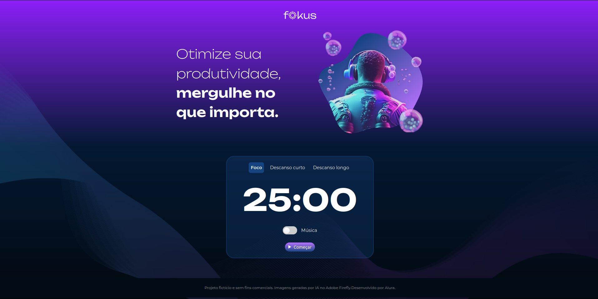
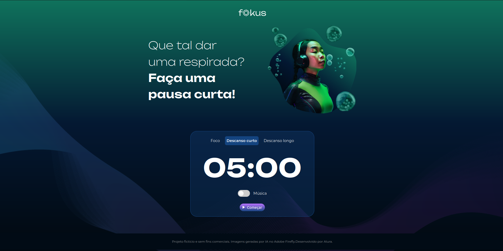
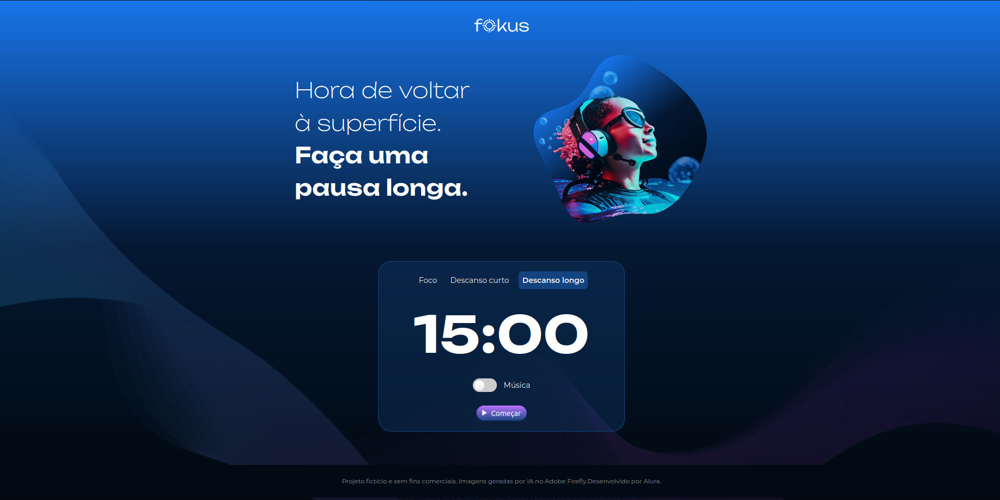
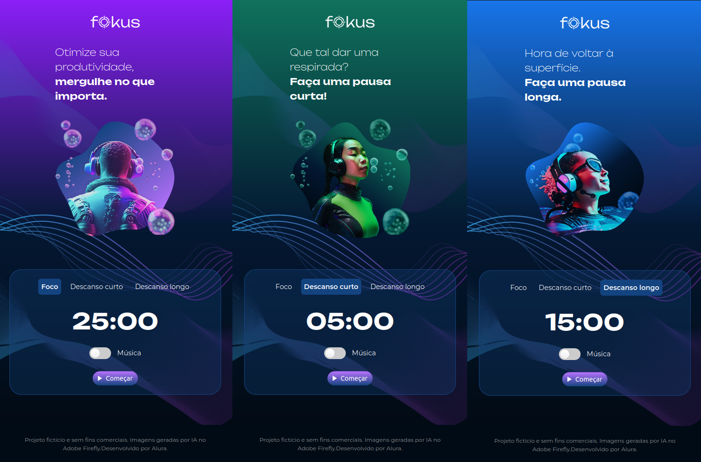

# Fokus - Controle de Tempo e Tarefas

Este projeto tem como objetivo a construção de um aplicativo web utilizando a metodologia Pomodoro, focando em técnicas para manipulação do DOM utilizando JavaScript. Durante o desenvolvimento, foram explorados conceitos como querySelectors, getElementById, construção de funções (incluindo funções declarativas, arrow functions e funções anonimas), instanciamento de objetos e suas propriedades, utilização de setAttribute e getAttribute. Implementamos funções para contagem regressiva no cronômetro, utilizando propriedades como textContent e innerHTML e suas distinções. Também foram construídos objetos de áudio com suas propriedades, como play, paused e pause, além de objetos do tipo Date e suas propriedades, como toLocaleTimeString.

## :dizzy: Tecnologias utilizadas

<div>
  
  
  
</div>


## :computer: Visão Geral do Projeto

### Interface Fokus - Foco: 


### Interface Fokus - Descanso curto: 


### Interface Fpkus - Descanso longo: 


### Interface Fokus Responsiva:

<div style="display: flex; justify-content: flex-start; gap: 90px;">    
    
</div>

## :hammer: Funcionalidades

- `Temporizador`: três modelos de temporizador: foco, Descanso curto e Descanso longo.
- `Foco`: temporizador de 25 minutos.
- `Descanso curto`: temporizador de 5 minutos.
- `Descanso longo`: temporizador de 15 minutos.
- `Reset temporizador`: clicar no botão foco, Descanso curto ou Descanso longo, além de mudar de aba reseta o temporizador.
- `CheckBox música`: habilita e desabilita música de fundo.
- `Botão começar ou pausar`: inicia e pausa o temporizador.
- `Responsividade`: responsivo para diferentes dispositivos.


## :mag: Demonstração

Para uma experiência completa e visual do projeto Fokus em funcionamento, você pode acessar a demonstração interativa do projeto, [clicando aqui.](https://charlesbrcosta.github.io/Fokus-Controle-de-Tempo-e-Tarefas/)

## :warning: Pré-requisitos

- Navegador web moderno que suporte HTML5, CSS3 e JavaScript.

## :dvd: Baixar o projeto no computador

1. Clone o repositório:

   ```bash
   git clone https://github.com/charlesbrcosta/Fokus-Controle-de-Tempo-e-Tarefas.git
   cd Fokus-Controle-de-Tempo-e-Tarefas

2. Abra o arquivo index.html no seu navegador.

## :paperclip: Contribuição

1. Faça um fork do projeto.
2. Crie uma branch para a sua contribuição (git checkout -b feature/nova-funcionalidade).
3. Faça as alterações necessárias e commit (git commit -am 'Adicionando nova funcionalidade').
4. Push para a branch (git push origin feature/nova-funcionalidade).
5. Crie um novo Pull Request.

## :student: Autor

[<br><sub>Charles Bruno</sub>](https://github.com/charlesbrcosta)


## :page_facing_up: Licença

Este projeto está licenciado sob a [Licença MIT](https://www.mit.edu/~amini/LICENSE.md).
